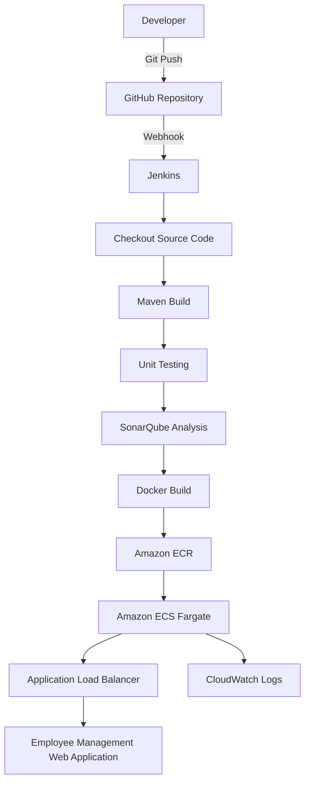

# Employee Management Web Application - DevOps CI/CD Pipeline

## Project Overview

This project demonstrates a complete CI/CD pipeline for deploying a Spring Boot Employee Management Web Application on AWS using modern DevOps tools and practices.

The application is automatically built, analyzed, containerized, and deployed whenever code is pushed to GitHub.

---

## Architecture

GitHub
↓
Webhook / Jenkins Poll SCM
↓
Jenkins Pipeline
↓
Checkout Source Code
↓
Maven Build & Unit Testing
↓
SonarQube Code Analysis
↓
Docker Image Build
↓
Amazon Elastic Container Registry (ECR)
↓
Amazon Elastic Container Service (ECS Fargate)
↓
Application Load Balancer
↓
Employee Management Web Application

---

## Tech Stack

- Java 17
- Spring Boot
- Maven
- Git & GitHub
- Jenkins
- SonarQube
- Docker
- Amazon ECR
- Amazon ECS (Fargate)
- Application Load Balancer
- AWS IAM
- CloudWatch

---

## CI/CD Pipeline

The Jenkins pipeline performs the following stages:

- Checkout source code from GitHub
- Build application using Maven
- Execute unit tests
- Perform SonarQube code analysis
- Build Docker image
- Push Docker image to Amazon ECR
- Deploy latest image to Amazon ECS
- Force new deployment of ECS Service

---

## AWS Services Used

- Amazon ECS (Fargate)
- Amazon ECR
- Application Load Balancer
- Target Groups
- IAM Roles
- CloudWatch Logs

---

## Features

- Employee CRUD Operations
- User Authentication using Spring Security
- Dockerized Spring Boot application
- Automated CI/CD deployment
- Containerized deployment on ECS
- Application Load Balancer integration
- Centralized logging using CloudWatch

---

## Challenges Solved

- Jenkins integration with GitHub
- Docker image creation and versioning
- Amazon ECR authentication
- IAM permission troubleshooting
- ECS Service deployment
- Application Load Balancer configuration
- Target Group health checks
- Spring Security health endpoint configuration
- CloudWatch log monitoring

---

## Learning Outcomes

Through this project, I gained hands-on experience with:

- Continuous Integration & Continuous Deployment
- Infrastructure deployment on AWS
- Docker containerization
- Jenkins Pipeline development
- Container orchestration using ECS
- Monitoring and debugging cloud deployments
- DevOps troubleshooting and automation

---
## CI/CD Architecture

## Author

Hadi Ali Abbas Mir

B.Tech Computer Science Engineering

Islamic University of Science and Technology (IUST)